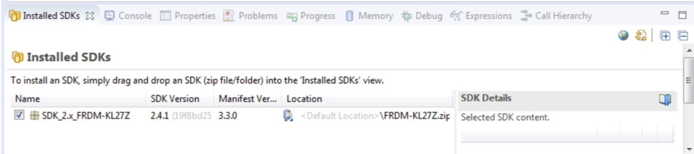
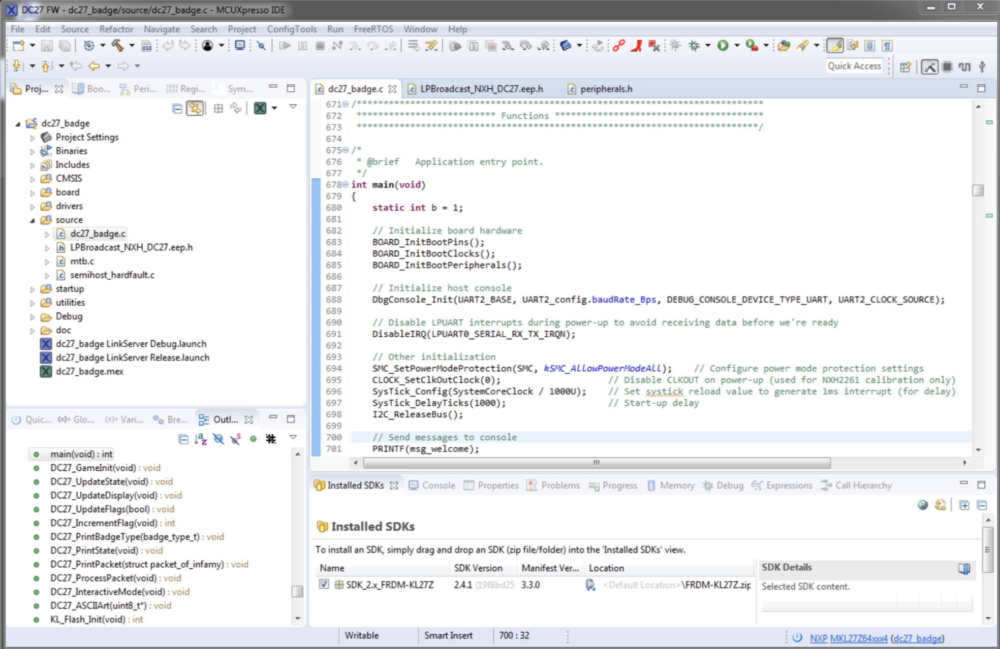
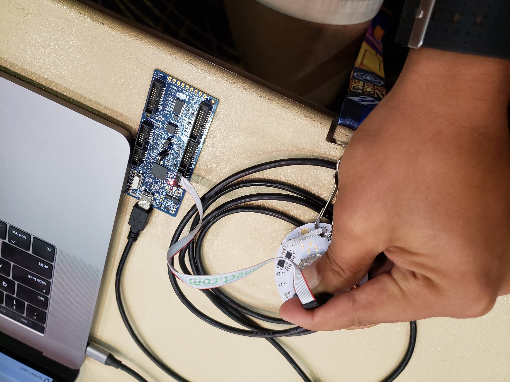
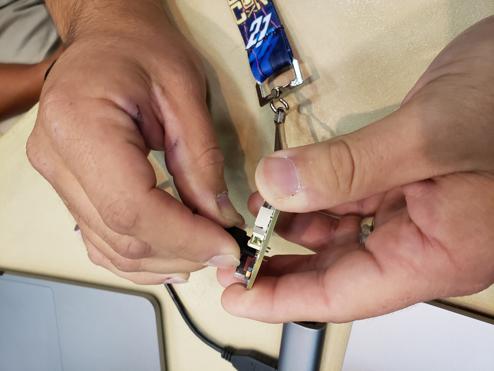
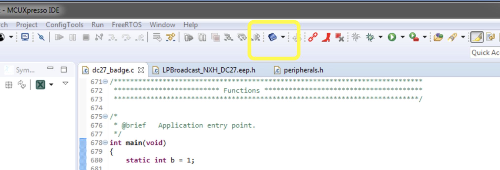
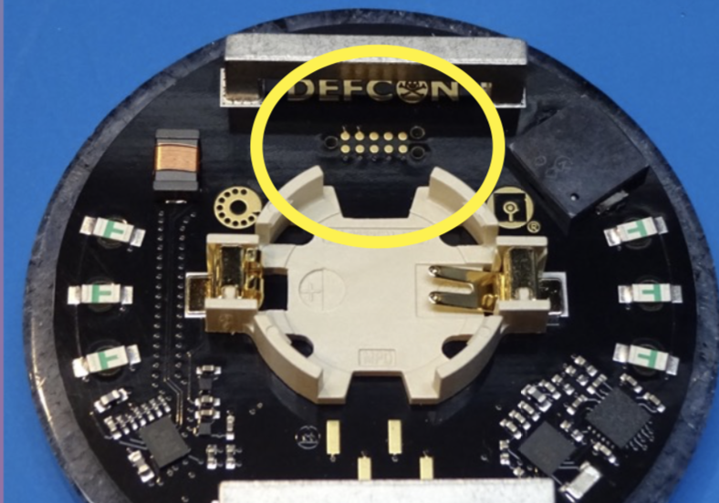
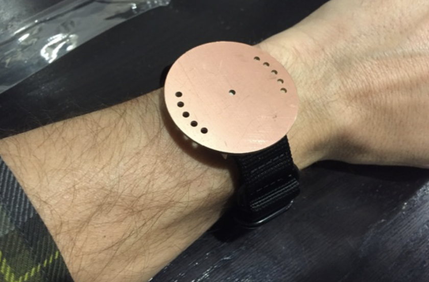

# Jackp0t
Modifies your DEFCON27 Badge into a Jackp0t badge that will complete other attendee's badge challenge/trigger rick roll when held within a few inches of each other.

Click the image below to watch the video.

[](https://youtu.be/yLcS24CV8U8)

Contributors:
- [Halcy0nic](https://twitter.com/Halcy0nic)
- [mlaerten](https://twitter.com/mlaerten)
- [Nick Engmann](https://twitter.com/NickySlicksHaha)

# Table of Contents
1. [The Challenge](#the-challenge)
2. [Required Hardware](#required-hardware)
3. [Required Software](#required-software)
4. [Flashing](#flashing)
    1. [LPC-Link2 Setup](#lpc-link2-setup)
    2. [Black Magic Probe Setup](#black-magic-probe-setup)
5. [Future Applications](#future-applications)
6. [Credits](#credits)
7. [License](#license)

## The Challenge
This year's DEFCON Badge challenge involved social interactions with an RF Badge. A regular attendee is challenged to find and touch badges with 10 different badge types (including Sponsors, Vendors, Goons, and even Press). This becomes super challenging when you have to find one of the 20 individuals out of a 30,000 person conference with a Black "UBER" badge (an exciting but non-trivial task).  It was much easier for us to figure out how to flash the DEFCON27 badge to do three things:

1. Automatically complete the "touch 10 different badge types" challenge
2. Easily help our fellow attendees by unlocking their badges with one that can act as a chameleon, emulating all other badge types.
3. Profit ???

That's what the Jackp0t badge does. It automatically puts you in a "COMPLETE" (or win) state on boot and emulates all the different badge types to complete other attendee's badges in a matter of seconds. 

[Check out our demo video](https://youtu.be/2Dge06hO1Co)

[How Did you Become a Village?](https://youtu.be/owiwTgvgGdE)

[Quality Rick Roll](https://youtu.be/Qs6HjLnBc5k)

## Required Hardware

- [DEFCON27 Badge](https://hackaday.com/2019/08/08/first-look-at-def-con-27-official-badge-kingpin-is-back/)
- [Tag-Connect TC2050-IDC-NL-050-ALL (normal orientation)](http://www.tag-connect.com/node/199)
    - trim alignment pins if using w/ mounted gemstone • vtref provides 1.8V i/o level to debug probe
- [NXP LPC-Link2](https://www.nxp.com/design/microcontrollers-developer-resources/lpc-microcontroller-utilities/lpc-link2:OM13054) OR a [Black Magic Probe](https://1bitsquared.com/products/black-magic-probe)
    - These devices in conjunction with the Tag-Connect will allow you to interface with the JTAG/SWD interface on the DEFCON Badge.
- (Optional) [Micro 1v8 USB Serial UART](http://jim.sh/1v8/) OR [Black Magic Probe](https://1bitsquared.com/products/black-magic-probe)
    - Having UART access to the badge is super useful for debugging issues/reading badge state.

## Required Software
- [nxp MCUXpresso IDE 10.2.1](https://media.defcon.org/DEF%20CON%2027/DEF%20CON%2027%20badge/Development%20Environment/MCUXpressoIDE_10.2.1_795.exe)
    - an IDE developed by NXP to use with the LPC-Link2. If you are flashing using the Black Magic Probe you won't need this.
- [FRDM-KL27Z SDK 2.4.1](https://media.defcon.org/DEF%20CON%2027/DEF%20CON%2027%20badge/Development%20Environment/SDK_2.4.1_FRDM-KL27Z.zip)
    - the SDK for interacting with the MKL27Z64VDA4 microcontroller with the MCUXpresso IDE.
- [GDB](https://www.gnu.org/software/gdb/download/)
    - Powerful GNU Project Debugger. Used to interact with the Black Magic Probe to flash images

## Flashing
We confirmed two different ways to flash. One using the [LPC-Link2 + Tag-Connect Cable](#lpc-link2-setup) and one using a [Black Magic Probe + Tag-Connect Cable](#black-magic-probe-setup). Depending on your available hardware/software please reference the appropriate section.

### LPC-Link2 Setup
1. Install the [MCUXpresso IDE]((https://media.defcon.org/DEF%20CON%2027/DEF%20CON%2027%20badge/Development%20Environment/MCUXpressoIDE_10.2.1_795.exe)) on a Windows Machine.

2. Install the [SDK](https://media.defcon.org/DEF%20CON%2027/DEF%20CON%2027%20badge/Development%20Environment/SDK_2.4.1_FRDM-KL27Z.zip) by dragging and dropping the SDK Zip file into the MCUXpresso IDE.

    

3. Clone the Jackp0t repo.

```
    $ git clone https://github.com/NickEngmann/Jackp0t.git
```

4. Copy/Import the Jackp0t/dc27_badge folder into the MCUXpresso IDE.

    

5. Plug the Tag-Connect Cable into the LPC-Link2.

    

5. Attach the Tag-Connect Cable to the DEFCON27 Badge.

    

6. Click on the Flash Button to Flash the Board.

    

### Black Magic Probe Setup
0. [Download the jackp0t.bin binary](https://github.com/NickEngmann/Jackp0t/releases/download/0.9/jackp0t.bin)
1. Install [GDB](https://www.gnu.org/software/gdb/download/)
2. Plug in the Black Magic Probe into your computer via USB.
3. [Update the firmware on the Black Magic Probe.](https://github.com/blacksphere/blackmagic/wiki/Upgrading-Firmware)

    We initially ran into a lot of issues with the default firmware on the Black Magic Probe. If you update the firmware using the master branch of the wiki, flashing the device was becomes far more consistent. Check out [Ross' instructions](https://rhye.org/post/defcon-27-badge-writeup/) on how to upgrade the firmware on the Black Magic Probe:

    >To update your black magic probe, clone the firmware repo from Github build it with make and then perform a DFU update on your probe with the following command:

    > ```
    > sudo dfu-util -d 1d50:6018,:6017 -s 0x08002000:leave -D src/blackmagic.bin
    > ```
    >  -- <cite>Ross Schlaiker</cite>

4. Open up the arm toolchain.

    ```
    $ arm-none-eabi-gdb
    ```

5. Connect to the Black Magic Probe Device via GDB.

    ```
    $ (gdb) target extended-remote <device> 
    ```
    On OSX <device> is /dev/cu.usbmodem <some ##>

    On Linux <device> is /dev/ttyUSB0

6.  Touch the Black Magic Probe + Tag-Connect to the SWD pins on the badge.

    
    

7.  Use the `monitor swdp scan`  command to connect to the device using the Serial-Wire Debug Protocol.
    ```
    $ (gdb) monitor swdp scan
    ```
    Output:
    ```
        Target voltage: 1.8V
        Available Targets:
        No. Att Driver
        1      KL27x64 M0+
        2      Kinetis Recovery (MDM-AP)
    ```
    > If your scan doesn’t return KL27x64 M0+, and instead returns ‘Generic Cortex-M’, close GDB and retry. This seems to be a race condition of some sort.
    >  -- <cite>Ross Schlaiker</cite>
8. Attach to the KL27 Microcontroller.
    ```
    $ (gdb) attach 1
    ```

9. Allow GDB to allow access to memory outside of the device's known memory map. This is useful to allow access to memory mapped IO from GDB.
    ```
    $ (gdb) set mem inaccessible-by-default off
    ```
10. Set the binary file. Make sure the binary is in the current directory.
    ```
    $ (gdb) file jackp0t.bin
    ```
11. Load the binary onto the board.
    ```
    $ (gdb) load
    ```

# Future Applications
Figuring out how to edit the source code and successfully flash these badges opens the door to tons of different future hacks. Feel free to use these instructions as a jumping point to create complex hacks like turning the badge into a custom clock!



# Credits
- [DEFCON Badge Hacking Thread - Reddit](https://www.reddit.com/r/Defcon/comments/cnn2x7/dc_27_badge_hacking_thread/)
- [Ross Schlaikjer](https://rhye.org/post/defcon-27-badge-writeup/)
- [The Kingpin, Joe Grand](https://twitter.com/joegrand)

# License

This project is [MIT licensed](./LICENSE.md).
